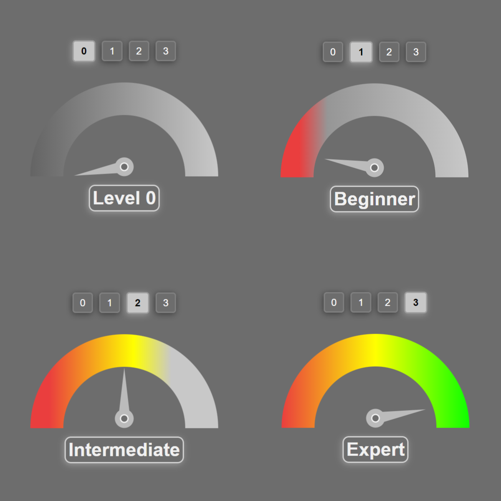

# Skill Meter

Skill Meter is a simple web application that allows you to visually represent skill levels using a meter and needle. This project provides a basic HTML, CSS, and JavaScript template to create a skill meter with adjustable skill levels.

## Live Demo: [Skill Meter](https://cognisolver.github.io/Skill-Meter/)



## Features

- Adjustable skill levels ranging from 0 to 3.
- Visual representation of skill level using a needle on a meter.
- Easy to customize and integrate into your web projects.

## Getting Started

These instructions will help you set up the Skill Meter on your local machine for development and testing purposes.

### Prerequisites

You will need a code editor and a web browser installed on your machine to work with this project.

### Installation

1. Clone the repository to your local machine:

   ```shell
   git clone https://github.com/yourusername/skill-meter.git
   ```

2. Navigate to the project directory:

   ```shell
   cd skill-meter
   ```

3. Open the `index.html` file in your preferred web browser or use a development server to serve the project.

## Usage

1. Open the `index.html` file in a web browser.

2. Choose a skill level by clicking on one of the radio buttons (0, 1, 2, or 3).

3. The skill meter will visually represent the selected skill level with a needle pointing to the corresponding level on the meter.

4. You can customize the appearance and behavior by modifying the HTML, CSS, and JavaScript files as needed.

## Customization

You can easily customize the Skill Meter by adjusting the CSS styles in the `styles.css` file and modifying the JavaScript functionality in the `script.js` file. Feel free to integrate this into your own projects and tailor it to your specific needs.

## Contributing

If you'd like to contribute to this project, please follow these steps:

1. Fork the repository on GitHub.

2. Clone your forked repository to your local machine.

3. Create a new branch for your feature or bug fix:

   ```shell
   git checkout -b feature/your-feature-name
   ```

4. Make your changes and commit them:

   ```shell
   git commit -m "Add your feature or bug fix"
   ```

5. Push your changes to your forked repository:

   ```shell
   git push origin feature/your-feature-name
   ```

6. Open a pull request on the original repository.

## License

This project is licensed under the MIT License - see the [LICENSE](LICENSE) file for details.

---

Feel free to reach out with any questions or feedback. Enjoy using the Skill Meter in your projects!
